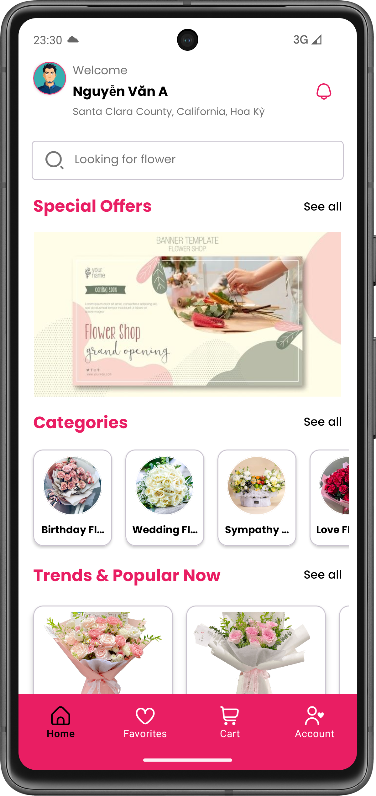
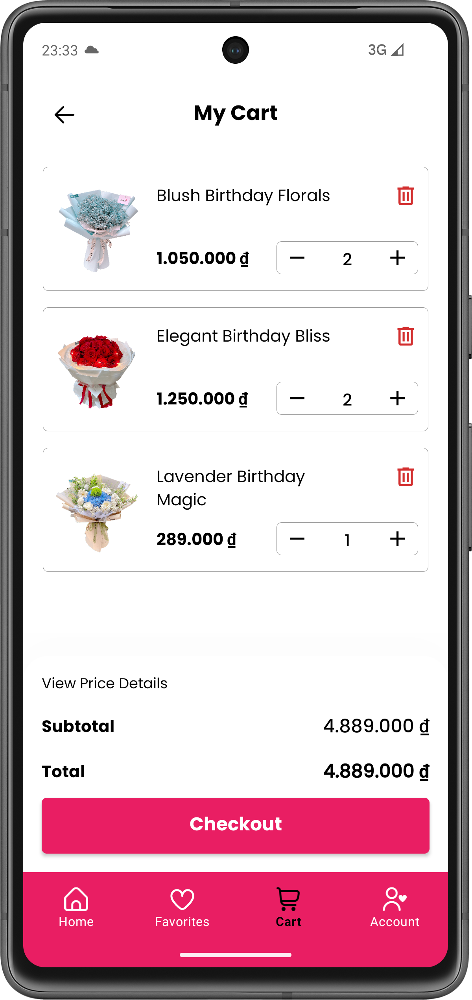
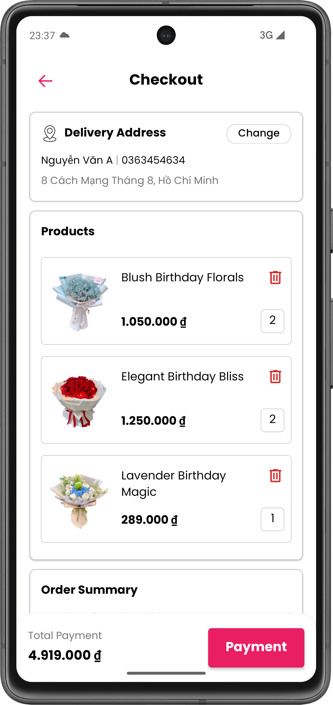
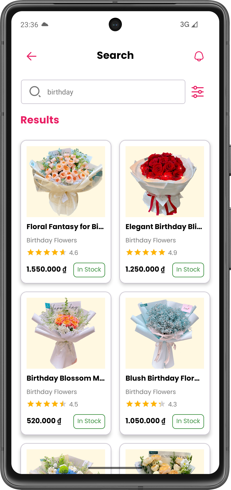
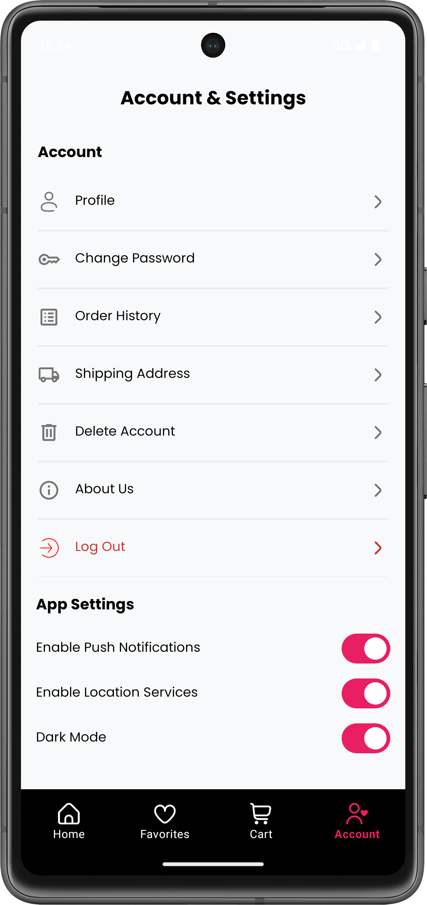

# **Flower Shop - Android App** 🌸  

A modern **Android e-commerce app** for buying fresh flowers, gifts, and related products. Built with best practices in mind, featuring a clean UI, secure payments, and real-time order tracking.  

<p align="center">
  
</p>  

## **Key Features**  
- 🌟 **Product Catalog**: Browse flowers, bouquets, and gifts with filters (price, occasion, category).  
- 🛒 **Cart & Checkout**: Add/remove items, multi-payment support (VNPay, MoMo, COD).  
- 📦 **Order Tracking**: Real-time status updates (Processing, Shipped, Delivered) with push notifications.  
- 🔐 **User Accounts**: Login via email, save addresses, and view order history.  

## **Tech Stack & Libraries**  
### **Core**  
- **Language**: 100% Kotlin  
- **Architecture**: MVVM + Clean Architecture  
- **Dependency Injection**: Dagger Hilt  
- **Navigation**: Jetpack Navigation Component  
- **Coroutines**: Kotlin Coroutines  

### **Networking**  
- **Retrofit** (REST API)  
- **OkHttp** (Logging Interceptor)  
- **Gson** (JSON Serialization)  

### **Persistence**   
- **DataStore** (Preferences)  

### **UI/UX**  
- **Glide** (Image Loading)  
- **Lottie** (Animations)  
- **DotsIndicator** (ViewPager Indicators)  
- **Yazantarifi Slider** (Image Slider)  

### **Payment Integration**  
- **MoMo Wallet SDK**  
- **VNPay** (Custom Integration)  

### **Miscellaneous**  
- **Firebase Cloud Messaging** (Push Notifications)  

## **Dependencies**  
```kotlin
// Lifecycle (ViewModel, LiveData)
implementation("androidx.lifecycle:lifecycle-viewmodel-ktx:2.7.0")
implementation("androidx.lifecycle:lifecycle-livedata-ktx:2.7.0")

// Navigation Component  
implementation("androidx.navigation:navigation-fragment-ktx:2.7.6")  

// Hilt (DI)  
implementation("com.google.dagger:hilt-android:2.56.1")  
ksp("com.google.dagger:hilt-android-compiler:2.56.1")  

// Retrofit + Gson  
implementation("com.squareup.retrofit2:retrofit:2.11.0")  
implementation("com.squareup.retrofit2:converter-gson:2.11.0")  

// Room DB  
implementation("androidx.room:room-runtime:2.6.1")  
ksp("androidx.room:room-compiler:2.6.1")  

// Glide (Images)  
implementation("com.github.bumptech.glide:glide:4.16.0")  

// MoMo Payment  
implementation("com.github.momo-wallet:mobile-sdk:1.0.7")  

// Full list in build.gradle.kts  
```

## **Screenshots**  
| Home | Cart | Checkout | Search |  Account |   
|------|------|----------|--------|----------|
|  |  |  |   | 

## **Installation**  
1. Clone the repo:  
   ```bash  
   git clone https://github.com/nguyen-dat-1612/blossy-flowerapp.git
   ```  
2. Open in **Android Studio** (or newer).  
3. Add your `google-services.json` for Firebase.  
4. Build and run!  

**Developed by Nguyen Thanh Dat** • [LinkedIn](www.linkedin.com/in/dat-nguyen-thanh-9b6303301) 
