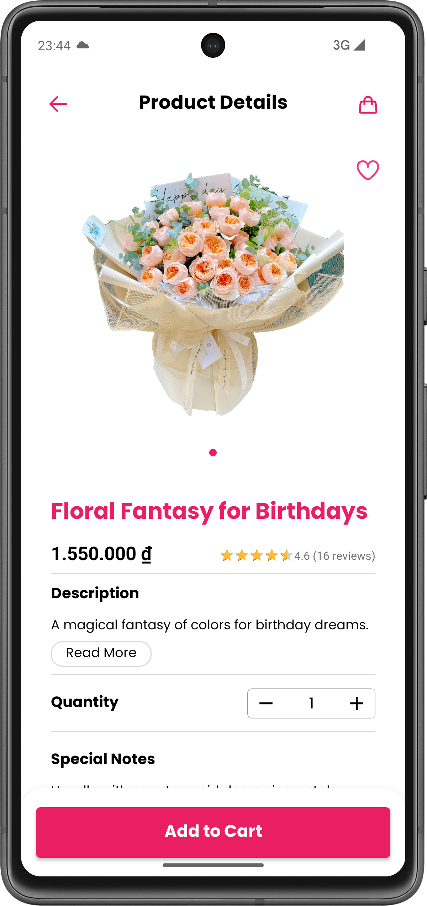

# 🌸 **Blossy Flower Store - Android App**

A modern e-commerce app for buying fresh flowers, gifts, and decorations. Built with clean architecture, user-friendly UI, secure payment, and real-time order tracking.

  

## 🚀 **Main Features**

* 🌼 **Product Categories**: Browse flowers and gifts by occasion, type, or price.
* 🛒 **Cart & Checkout**: Add/remove items, support multiple payment methods (VNPay, MoMo, COD).
* 📦 **Order Tracking**: Get real-time updates and push notifications for order status.
* 👤 **User Account**: Sign in with email, save address, and view order history.
* 🔔 **Push Notifications**: Powered by Firebase Cloud Messaging.

## ⚙️ **Tech Stack & Libraries**

### 🧱 **Architecture & Core**

* **Language**: 100% Kotlin
* **Architecture**: MVVM + Clean Architecture
* **Dependency Injection**: Dagger Hilt
* **Navigation**: Jetpack Navigation Component
* **Coroutines**: Kotlin Coroutines
* **View/Data Binding**: ViewBinding + DataBinding

### 🌐 **Networking**

* **Retrofit** + **Gson**: REST API calls
* **OkHttp**: Logging requests and responses

### 💾 **Local Storage**

* **SharedPreferences**: Save simple key-value data

### 🎨 **UI/UX & Animations**

* **Glide**: Load images smoothly
* **Lottie**: Nice animations
* **DotsIndicator**: Page indicators
* **Yazantarifi Slider**: Product image slider
* **SwipeRefreshLayout**: Pull-to-refresh feature

### 💰 **Payment**

* **VNPay**: Custom payment flow

### 🔔 **Firebase**

* **Firebase Messaging**: Push notifications

## 📸 **Screenshots**

| 🏠 Home | 🔍 Search | 📄 Product Details |
|--------|-----------|--------------------|
|  |  |  |

| 🛒 Cart | 💳 Checkout | 👤 Account | 📦 Order History |
|--------|-------------|-----------|------------------|
|  |  |  |  |

## 🔮 **What's Next**

* 🔧 Fix known bugs and improve app stability
* 💰 Add support for **MoMo** payment gateway
* 📱 Improve UI/UX for better shopping experience
* 🌐 Add multi-language support
* 📊 Add analytics to track user behavior and improve performance

---

📱 **Developed by Nguyen Thanh Dat**
🔗 [LinkedIn](https://www.linkedin.com/in/dat-nguyen-thanh-9b6303301)
